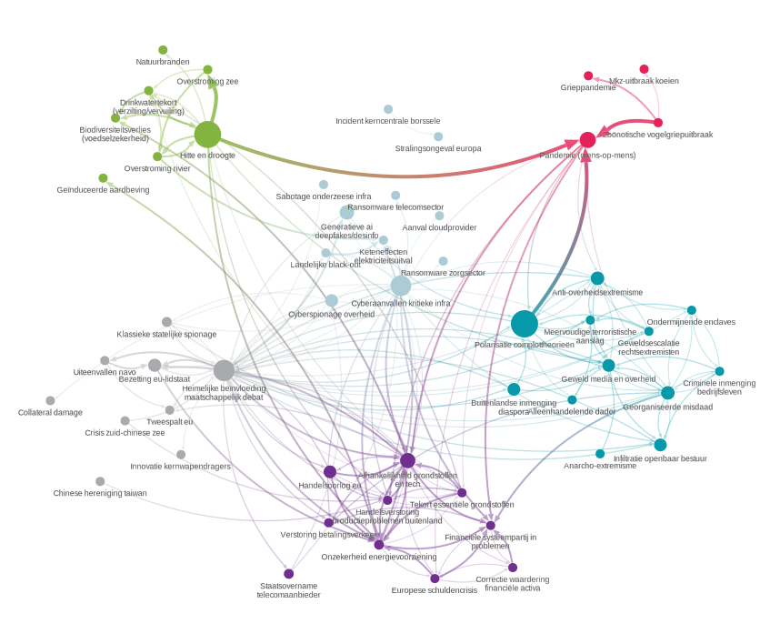

# Denkwerk Knooppuntenanalyse (Network Analysis)


This is the frontend visualization tool for the DenkWerk report "Weerbaarheid by Design - De vijf principes voor een weerbaar Nederland". The tool analyzes how threats interconnect and identifies central nodes that strengthen or cause other threats, providing insights for targeted interventions.

[See the full report](https://denkwerk.online/media/1155/weerbaarheid-by-design.pdf)



*The final graph of relationships between all threats considered. Explore it on the [hosted version of this repository](https://denkwerk-kickstartai.nl/knooppuntenanalyse).*

## Features

The tool provides an interactive network visualization using a custom-modified Reagraph library with WebGL rendering. The network displays identified national threats, where directed edges from threat A to threat B indicate that our methodology has discovered a significant volume of supporting citations linking these threats. For detailed information about the backend methodology, see the [report's appendix B](https://denkwerk.online/media/1156/weerbaarheid-by-design-appendix.pdf).

The analysis employs a directed Eigenvector Centrality algorithm to identify critical threat interconnections and highlight the most influential nodes within the network. Users can filter nodes by threat categories and explore both the network structure and its underlying citation data through an integrated tutorial system. The tool also includes additional example visualizations to demonstrate the approach and broader context.

## Technology Stack

- Frontend: React + TypeScript
- Visualization: Custom Reagraph library (WebGL-based network graphs)
- Styling: Tailwind CSS + shadcn/ui components
- Build Tool: Vite

## Project Structure

### Core Application (`/src`)

- `/components/layout/` - Main layout and supporting visualization components
  - `NarrativeLayout.tsx` - Primary application layout
  - `CentralNodeExample.tsx` - Example visualization demonstrating central node analysis
  - `TraditionalRiskMatrix.tsx` - Example risk matrix visualization
  - `TransformerAttentionVisualizer.tsx` - Example attention mechanism visualization

- `/components/visualization/` - Visualization components
  - `MainContent.tsx` - Main visualization container
  - `GraphChart.tsx` - Primary graph visualization
  - `NodeSelector.tsx` - Node filtering interface
  - `ColorLegend.tsx` - Color coding legend
  - `ThreatTable.tsx` - Tabular threat data display
  - `TutorialOverlay.tsx` - Interactive tutorial system

- `/components/visualization/networkGraph/` - Network analysis logic
  - `networkService.ts` - Core network data processing
  - `networkFetcher.ts` - Data fetching utilities
  - `eigenvectorCentrality.ts` - Centrality calculations
  - `threatImpactService.ts` - Threat analysis
  - `types.ts` - TypeScript definitions

- `/components/visualization/relationGraph/` - Relationship visualization (Interactive visualization supporting the main networkGraph)
  - `RelationGraphCanvas.tsx` - Relation-specific graph rendering
  - `GraphCanvas.tsx` - Base graph canvas component
  - `EdgeLine.tsx` - Edge rendering + interactivity component
  - `HierarchicalLayout.ts` - Contains the algorithm to sort this graph hierarchically

- `/components/ui/` - Reusable UI components (shadcn/ui)

### Network Analysis Library (`/reagraph`)

- Vendored copy of the Reagraph library with direct modifications
- Note: Due to time constraints, this is not a proper fork but rather a "dirty" modification of the original library
- The library has been copied directly into the project and modified in place for specific requirements
- Custom modifications include:
  - Added gradient color styling for edges
  - Made edges clickable for interaction
- Key features:
  - WebGL-powered rendering for high performance
  - Custom node and edge styling
  - Interactive selection and highlighting
  - Camera controls and scene management

### Data Files (`/public`)

- `nodes.json` - Network node data (from backend)
- `edges.json` - Network edge data (from backend)
- `threat_impact.json` - Threat impact analysis data (from methodology)

## Installation & Setup

1. Clone the repository
   ```bash
   git clone https://github.com/ICascha/knooppuntenanalyse-tool
   cd denkwerk-knooppuntenanalyse
   ```

2. Install dependencies
   ```bash
   npm install
   ```

3. Start development server
   ```bash
   npm run dev
   ```

4. Build for production
   ```bash
   npm run build
   ```

5. Preview production build
   ```bash
   npm run preview
   ```

## Data Format Examples

### Nodes (nodes.json)
```json
  {
    "id": "correctie op waardering financiële activa",
    "label": "correctie op waardering financiële activa",
    "citaten": [
      {
        "source": "cpb",
        "filename": 3374,
        "title": "Risicorapportage Financiële markten 2023",
        "publication_date": "2023-05-31 00:00:00",
        "document_type": "",
        "document_link": "https://www.cpb.nl/sites/default/files/omnidownload/CPB-Publicatie-Risicorapportage-Financiele-markten-2023.pdf",
        "citaat": "Het risico op een eurocrisis is iets toegenomen. Door de gestegen rentes betalen overheden meer voor hun leningen. ||| De renteontwikkelingen kunnen met name in Zuid-Europese landen zorgen creëren over de houdbaarheid van overheidsschulden. Deze zorgen kunnen zich vertalen in nog hogere rentelasten op overheidsschulden en kunnen zo leiden tot een nieuwe Europese schuldencrisis.",
        "oorzaak": "gestegen rentes",
        "gevolg": "europese schuldencrisis",
        "description": "Nederlandse financiële stelsel kan schokken opvangen in tijden van economische onzekerheid."
      },
      ...],
    "nr_docs": 244,
    "nr_citations": 10
}
```

### Edges (edges.json)
```json
  {
    "source": "(heimelijke) beïnvloeding en hybride operaties door statelijke actoren die aangrijpen op het maatschappelijk debat",
    "target": "cyberspionage overheid",
    "id": "(heimelijke) beïnvloeding en hybride operaties door statelijke actoren die aangrijpen op het maatschappelijk debat|||cyberspionage overheid",
    "label": "52 (Above threshold)",
    "weight": 1,
    "raw_count": 52,
    "original_citation_count": 15,
    "approved_citation_count": 2,
    "citaat_relaties": [
      {
        "source": "Ministerie van Justitie en Veiligheid",
        "filename": 10945,
        "title": "Nota naar aanleiding van het 2e verslag Wetsvoorstel uitbreiding strafbaarheid spionage",
        "publication_date": "2025-02-07 00:00:00",
        "document_type": "Kamerstuk (onderdeel)",
        "document_link": "https://open.overheid.nl/repository/dpc-b7518d0e776a67edd7a4d6cf7b4329adf6573791/1/pdf/ek-bijage-12-nnanv-wv-spionage-djversie.pdf",
        "citaat": "Een goed voorbeeld hiervan is de hack bij de politie van september 2024\nwaarvan de inlichtingen- en veiligheidsdiensten hebben aangegeven het zeer waarschijnlijk te\nachten dat een statelijke actor verantwoordelijk is.\nDaarbij zijn werkgerelateerde contactgegevens\nvan alle politiemedewerkers buitgemaakt en in sommige gevallen ook privégegevens.",
        "oorzaak": "(heimelijke) beïnvloeding door china/rusland",
        "gevolg": "digitale spionage door statelijke actoren via technologie",
        "description": "Minister Van Weel (JenV) reageert op het 2e verslag van de vaste Eerste Kamercommissie voor Justitie en Veiligheid (JenV) over het Wetsvoorstel uitbreiding strafbaarheid spionage."
      },
      ...]
  }
```

## Acknowledgments

This project utilizes a vendored copy of the [Reagraph](https://github.com/reaviz/reagraph) library, a high-performance WebGL network graph visualization component for React. Reagraph is an open-source project created by the team at [Reaviz](https://reaviz.dev/).